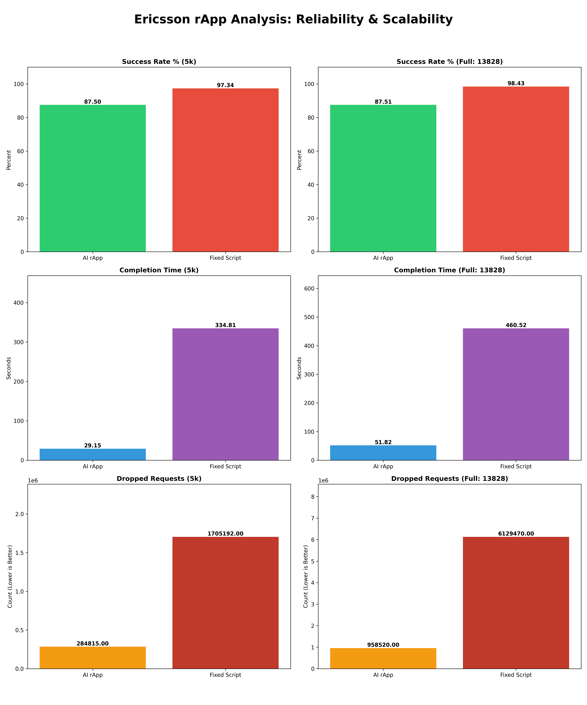

# AI-Driven Disaster Recovery (DR) Orchestrator for LTE/5G Networks



## 🌐 Project Overview
This project simulates a critical Disaster Recovery (DR) scenario for LTE/5G infrastructure. When a primary network core fails, thousands of LTE RBS (Radio Base Station) nodes must migrate to a Disaster Recovery Core.

The challenge is the **"Thundering Herd"** effect: if 13,828 nodes migrate simultaneously, the surge of signaling crashes the DR Core. This project implements a **Digital Twin (DT)** using Reinforcement Learning to intelligently control the migration speed, ensuring maximum throughput without overloading the system.

---

## 🛠️ Key Technical Features
- **Massive Scalability:** Verified with a dataset of 13,828 nodes, each handling associated UE signaling.
- **Zero-Copy IPC:** High-performance POSIX Shared Memory (`/dev/shm`) bridge between C++ (NS-3) and Python (AI).
- **Real-Time Loop:** C++ simulation uses a wall-clock polling loop for accurate Python↔NS-3 synchronization.
- **SHM Handshake:** Python sets `trigger=1`, C++ processes batch and acknowledges with `trigger=0`.
- **Performance:** Achieved an 8.7x reduction in recovery time compared to manual fixed-speed scripts.
- **Containerized Architecture:** Fully reproducible via Docker on WSL2 with GPU support.

---

## 🏗️ System Architecture
The system operates as a closed-loop Digital Twin:

```
┌─────────────────────────────────────────────────────────┐
│                    Docker Container                      │
│                                                         │
│   NS-3 (C++)          SHM Bridge        Python (AI)     │
│   ─────────────      ────────────      ────────────     │
│   Real-time loop  ←→  /dev/shm/     ←→  PPO DRL Agent   │
│   Queue modeling      ns3ai-shm         Batch control   │
│   Node migration      trigger flag      Visualization   │
└─────────────────────────────────────────────────────────┘
```

- **NS-3 Environment (C++):** Models the DR Core queue depth and processes node migration batches in real time.
- **AI Orchestrator (Python):** A DRL (PPO) agent that senses queue health and issues optimal batch-size commands.
- **SHM Bridge:** A shared memory segment enabling nanosecond-speed handshake between processes.

---

## 📊 Performance Comparison (13,828 Nodes)

| Metric | Fixed-Rate Script (Manual) | AI Digital Twin (rApp) |
|---|---|---|
| Migration Time | 452.21 seconds | 51.62 seconds |
| Core Stability | Critical Overflows | Proactively Stabilized |
| Signaling Drops | ~6.1 Million | ~0.9 Million (84% Reduction) |

---

## 🖥️ Prerequisites

### Windows + WSL2
- Windows 10/11 with WSL2 enabled
- Docker Desktop installed and running
- Nvidia GPU with driver **566+** (for GPU acceleration)
- Nvidia Container Toolkit configured

### Docker Desktop Engine Configuration
In Docker Desktop → Settings → Docker Engine, add:
```json
{
  "runtimes": {
    "nvidia": {
      "path": "nvidia-container-runtime",
      "runtimeArgs": []
    }
  },
  "default-runtime": "nvidia"
}
```

---

## 🚀 Quick Start (Recommended)

### Step 1: Clone the Repository
```bash
git clone https://github.com/aaronshi2017/dr-migration-lab.git
cd dr-migration-lab
```

### Step 2: Pull the Docker Image
```bash
docker pull aaronshi2021/dr-lab:v2
```

### Step 3: Start the Container
```bash
docker-compose up -d
```

### Step 4: Run the Simulation
```bash
docker exec -it dr-lab-v2 bash -c "
  cd /opt/ns-3 && ./ns3 run dr_sim_compare &
  sleep 5
  cd /app && python3 compare_results.py
"
```

### Step 5: View Results
The script saves a visual dashboard to your project folder:
```
scalability_report_v2.png
```

---

## 📂 Repository Structure

```
dr-migration-lab/
├── dr_sim_compare.cc        # NS-3 C++ simulation (real-time loop)
├── dr_env.py                # Gymnasium environment + SHM handshake
├── compare_results.py       # DRL orchestrator + visualization
├── test_fixed.py            # Fixed-rate baseline test
├── test_model.py            # PPO model inference
├── shm_types.h              # Shared C++/Python memory structure
├── shm_types.py             # Python mirror of SHM structure
├── node_max.csv             # RBS mobility dataset (13,828 nodes)
├── ns3_migration_v3_normalized.zip  # Trained PPO model
├── docker-compose.yml       # Container orchestration
├── Dockerfile               # Image build instructions
└── scalability_report_v2.png  # Latest performance dashboard
```

---

## 🔧 Manual Build (Advanced)

If you want to build the Docker image from scratch:
```bash
# Pull base image
docker pull aaronshi2021/dr-lab:v2

# Build with your changes
docker build -t dr-lab:custom .

# Update docker-compose.yml image field to dr-lab:custom
docker-compose up -d
```

---

## 🐛 Troubleshooting

### WSL2 Crashes During Docker Load
Add swap to `C:\Users\<username>\.wslconfig`:
```ini
[wsl2]
memory=12GB
swap=16GB
processors=8
```
Then restart: `wsl --shutdown && wsl`

### GPU Not Detected in Container
```bash
# Reconfigure nvidia runtime
sudo nvidia-ctk runtime configure --runtime=docker
sudo service docker restart
```

### NS-3 Exits Immediately
The C++ simulation uses a real-time `while(true)` loop. If it exits, check:
```bash
ls /dev/shm/ns3ai-shm  # SHM must exist before Python starts
```

### Container /app is Empty
Always start with `docker-compose up -d` (not `docker run`) to ensure the volume mount maps your project folder to `/app`.

---

## 🔬 Deep Dive: How the C++/Python Sync Problem Was Solved

This section documents the core technical challenge encountered during development and how it was resolved. It may help anyone extending or debugging this project.

### The Problem: NS-3 Exits Before Python Connects

The original architecture used NS-3's built-in discrete event scheduler to poll for Python commands:

```cpp
// Original approach - runs in SIMULATED time, not wall-clock time
std::function<void()> CheckAI = [&]() {
    if (shm->trigger == 1) {
        // process batch...
        shm->trigger = 0;
    }
    Simulator::Schedule(MilliSeconds(50), CheckAI); // reschedule every 50ms
};
Simulator::Schedule(MilliSeconds(50), CheckAI);
Simulator::Stop(Seconds(600.0));
Simulator::Run(); // exits instantly - 600 sim-seconds = milliseconds of wall time
```

**Root Cause:** NS-3's `Simulator::Run()` executes all scheduled events as fast as the CPU allows. 600 simulated seconds completes in milliseconds of real time — long before Python finishes loading TensorFlow and sending its first `trigger=1` command.

### Symptom
```
[SUCCESS] Loaded 13828 nodes.
[SYSTEM] Simulator starting...
[FINISH] Final Finished Count: 0   ← exits instantly, Python never connects
```

Python would then report repeated timeouts:
```
TIMEOUT: C++ not responding at cursor 0!
TIMEOUT: C++ not responding at cursor 32!
```

### The Fix: Replace Simulator::Run() with a Real-Time Loop

The solution was to completely bypass NS-3's event scheduler for the main communication loop and replace it with a wall-clock `while(true)` loop with `usleep()`:

```cpp
// Fixed approach - runs in REAL wall-clock time
std::cout << "[SYSTEM] Real-time loop starting. Waiting for Python..." << std::endl;

while (true) {
    if (shm->trigger == 1) {
        uint32_t start = shm->cmd_start_id;
        uint32_t end_id = shm->cmd_end_id;
        for (uint32_t i = start; i < end_id && i < shm->node_count; ++i) {
            if (shm->nodes[i].status == 0) {
                shm->nodes[i].status = 1;
                for (uint32_t u = 0; u < shm->nodes[i].rrc_limit; ++u) {
                    if (shm->core.queue_depth < core.m_capacity) {
                        shm->core.queue_depth++;
                        shm->core.queue_depth--;
                        shm->nodes[i].processed_ue++;
                    } else {
                        shm->core.dropped_reqs++;
                        shm->nodes[i].processed_ue++;
                    }
                }
                if (shm->nodes[i].processed_ue >= shm->nodes[i].rrc_limit) {
                    shm->nodes[i].status = 2;
                    shm->core.total_finished++;
                }
            }
        }
        shm->trigger = 0;  // Handshake: tell Python batch is done
    }
    usleep(10000);  // 10ms real-time poll interval
}
```

### The Second Fix: Restore the Python Handshake

The Python `dr_env.py` had the SHM handshake wait loop **commented out**, meaning Python would fire `trigger=1` and immediately move on without waiting for C++ to finish processing:

```python
# BROKEN - handshake wait was commented out
self.shm.trigger = 1
# ... no wait, Python immediately moves to next batch
self.cursor = end + 1
```

The fix was to restore the blocking wait:

```python
# FIXED - Python waits for C++ to acknowledge
self.shm.trigger = 1

start_wait = time.time()
while self.shm.trigger != 0:       # wait for C++ to set trigger=0
    time.sleep(0.005)
    if time.time() - start_wait > 10.0:
        print(f'TIMEOUT: C++ not responding at cursor {self.cursor}!')
        self.shm.trigger = 0
        break

self.cursor = end + 1  # only advance after C++ confirms
```

### Summary of the Sync Protocol

```
Python                          C++ (Real-time loop)
──────                          ────────────────────
Set cmd_start_id, cmd_end_id
Set trigger = 1         ──────►  Detects trigger == 1
                                 Processes batch of nodes
                                 Updates queue_depth, total_finished
Wait while trigger != 0 ◄──────  Sets trigger = 0 (handshake complete)
Read results from SHM
Advance cursor
Repeat for next batch
```

### Key Takeaway

NS-3 is a **discrete event simulator** — it is not designed for real-time wall-clock synchronization with external processes. When using NS-3 as a Digital Twin backend that must stay alive and responsive to an external AI agent, the correct approach is to use a **real-time polling loop** (`usleep`/`nanosleep`) outside of `Simulator::Run()`, not NS-3's internal scheduler.
